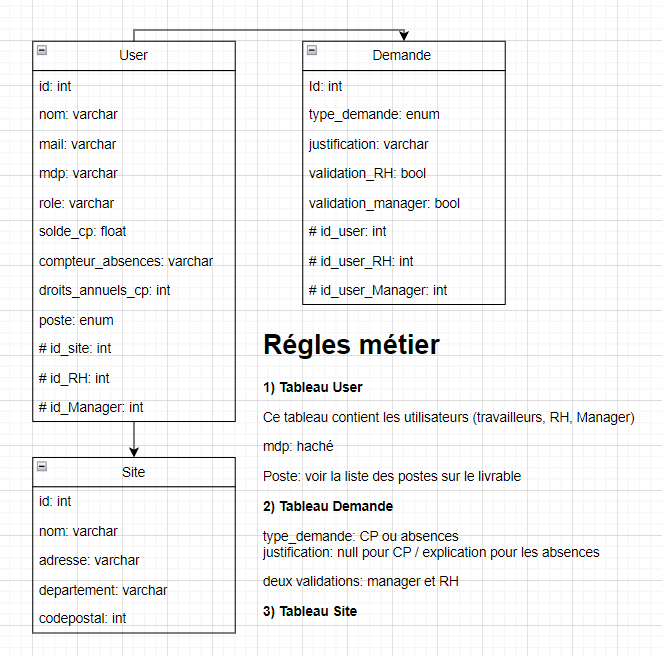

# TAI
Le code source de notre projet universitaire TAI
L'équipe est composé de trois membres.
C'est un progiciel codé en Java pour la gestion des absences et congés payés dans une entreprise.
Technologies utilisés: Java, MySQL, PHPmyAdmin, ...

## Documents importants
Lien du DCA: https://netestia-my.sharepoint.com/:w:/g/personal/x_ceccon_net_estia_fr/Ee0AsqKgVvhJnY3-y-IceDYBLbkKCiNpho74OOr9y5hObw?e=F1D8A5

## BDD
Voici la structure de la base de données
